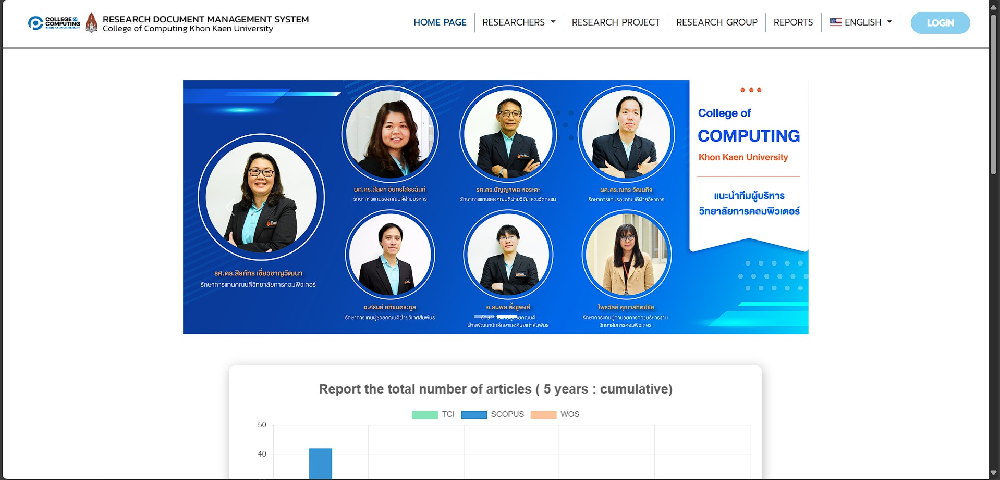
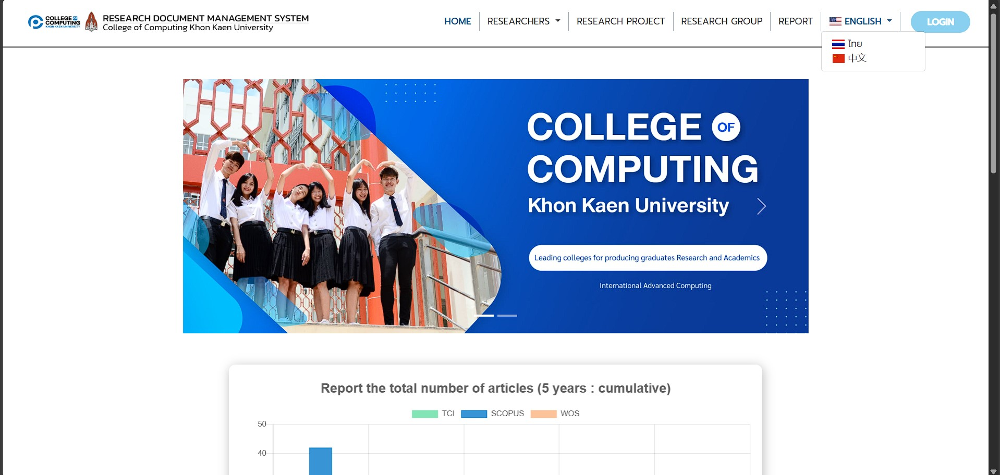
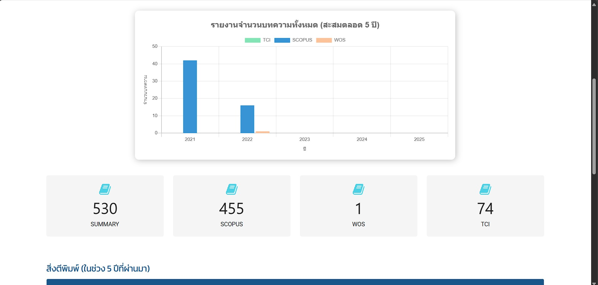
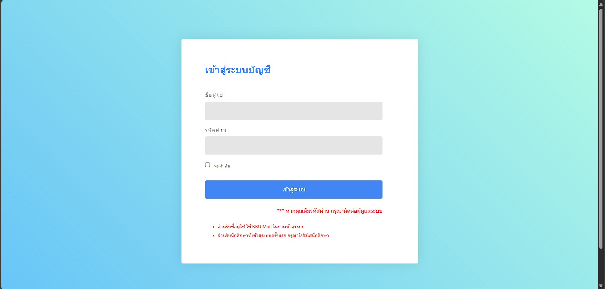
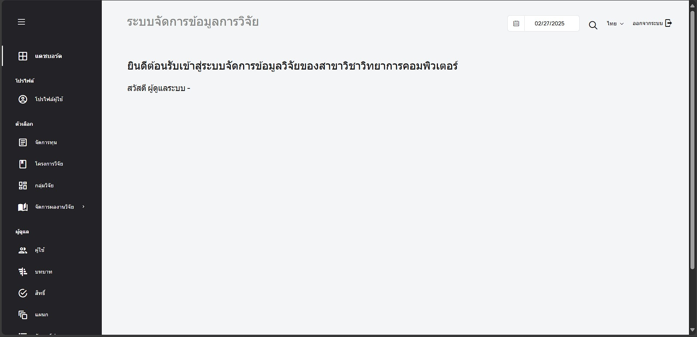
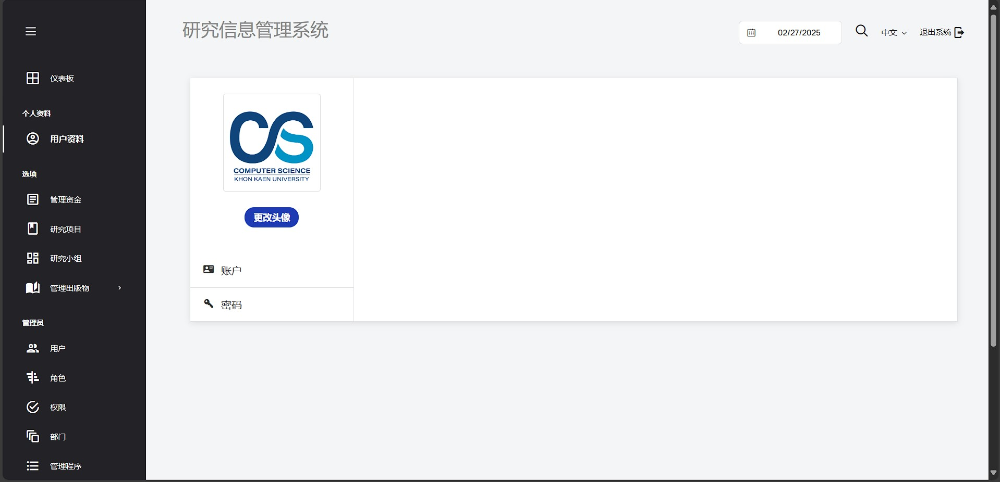

# คู่มือการใช้งานระบบ (User Manual)

📌 **ลิ้งค์งานของโปรเจคกลุ่ม:** [CS Group 5](https://csgroup568.cpkkuhost.com/)

---

## 1. เปลี่ยนภาษา หน้า Home

1. คลิกที่ **Dropdown** เพื่อเลือกภาษาที่ต้องการ  
     
     
     

---

## 2. เปลี่ยนภาษา หน้า Dashboard 

1. คลิกที่เมนู **"LOGIN"**  
     

2. กรอกข้อมูลสำหรับเข้าสู่ระบบ:  
     

3. กด **"LOGIN"** เพื่อเข้าถึงระบบ  

4. คลิกที่ **Dropdown** เพื่อเลือกภาษาที่ต้องการ  
     
     

---
