# คู่มือการใช้งานระบบ (User Manual)

📌 **ลิ้งค์งานของโปรเจคกลุ่ม:** [CS Group 5](https://csgroup568.cpkkuhost.com/)

---

## 1. เปลี่ยนภาษา หน้าหลัก

1. คลิกที่ **Dropdown** เพื่อเลือกภาษาที่ต้องการ  

   เมื่อเข้าสู่หน้าเว็บแล้วภาษาเริ่มต้นจะเป็นภาษาอังกฤษ
   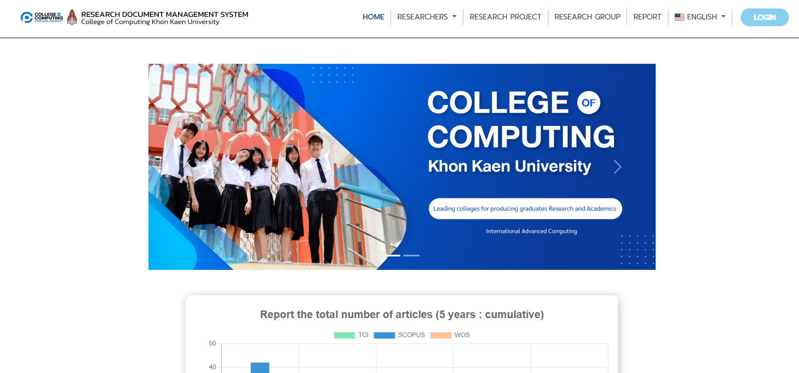  
   สามารถเลือกเปลี่ยนภาษาโดยสามารถกดได้ที่ปุ่ม dropdown ตามภาพข้างล่าง
   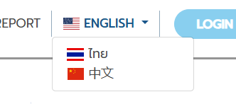
   หน้าหลักเมื่อกดปุ่มแปลเป็นภาษาไทย
   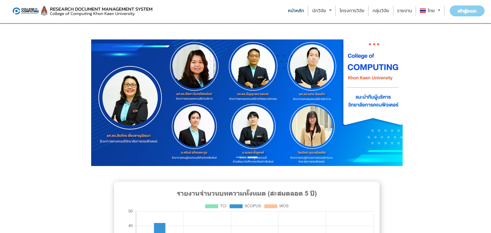
   หน้าหลักเมื่อกดปุ่มแปลเป็นภาษาจีน
   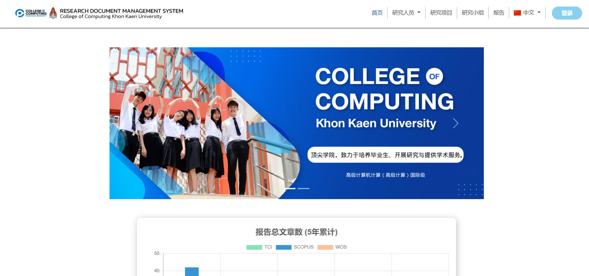
   
2. เมื่อเลือกภาษาที่ต้องการจะเปลี่ยนแล้วแถบเมนูต่างๆก็จะเปลี่ยนตามภาษานั้นด้วย

   เมื่อเลือกเป็นภาษาอังกฤษ
   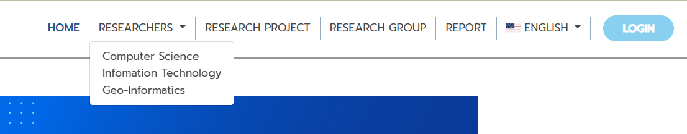
   เมื่อเลือกเป็นภาษาไทย
   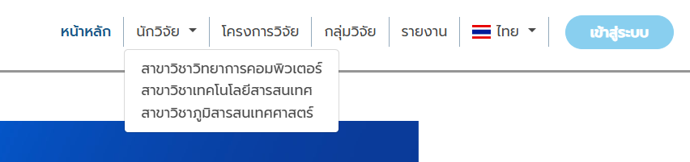
   เมื่อเลือกเป็นภาษาจีน
   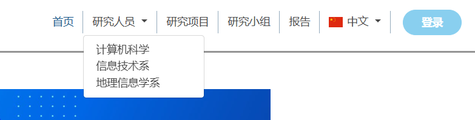

3. ในส่วนของเมนูต่างในหน้าหลักก็สามารถเปลี่ยนภาษาได้ตามที่่เลือกในทุกหน้า

   เช่นในเมนู researcher Detail 
   ในภาษาอังกฤษ
   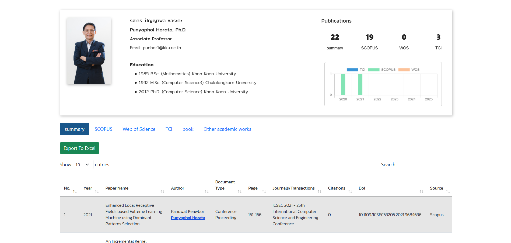
   ในภาษาไทย
   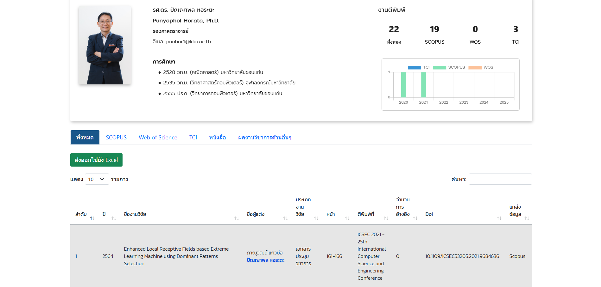
   ในภาษาจีน
   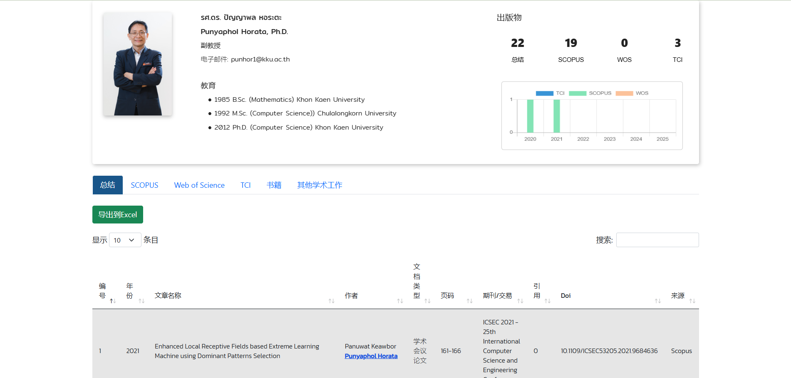

   ในเมนู Research Project
   ในภาษาอังกฤษ
   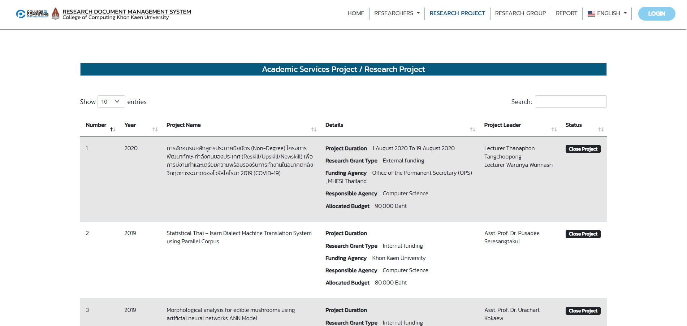
   ในภาษาไทย
   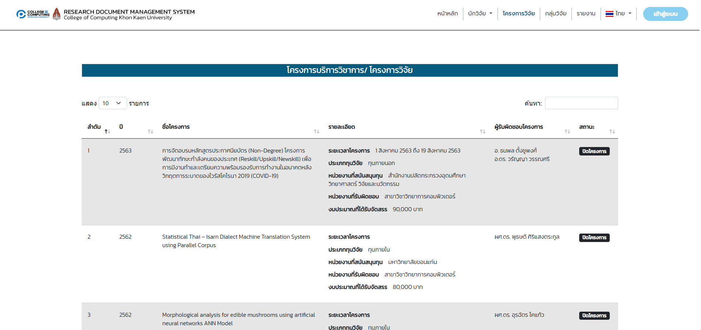
   ในภาษาจีน
   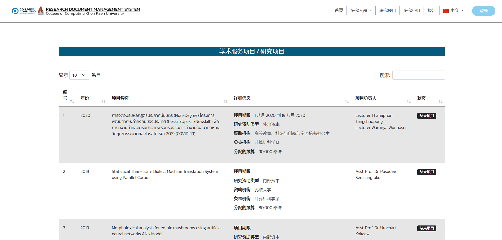

---
## 2. เปลี่ยนภาษา หน้า Login
1. เมื่อเข้าสู่หน้า Login แล้วภาษาจะเปลี่ยนตามที่เราเลือก
   ในภาษาอังกฤษ 
   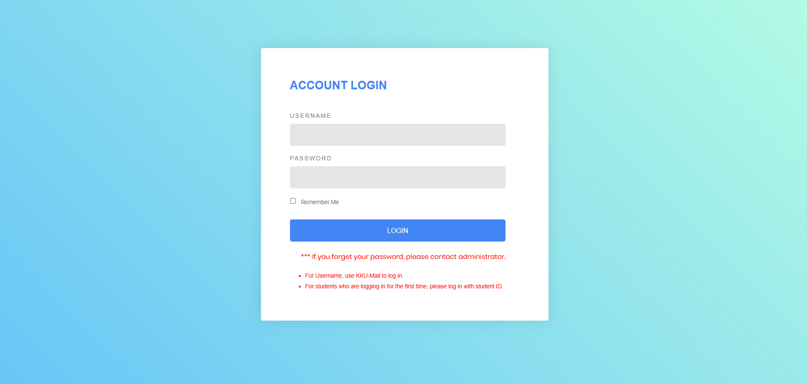
   ในภาษาไทย
   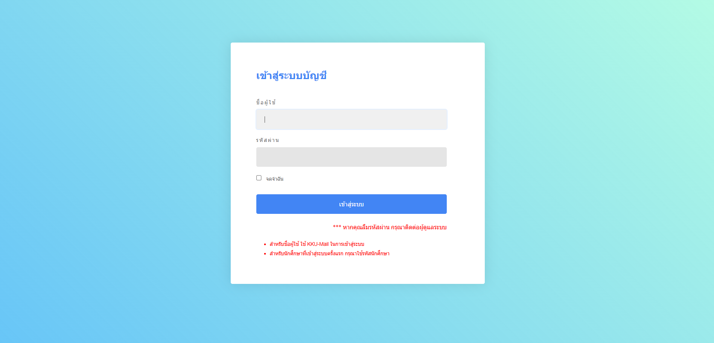
   ในภาษาจีน
   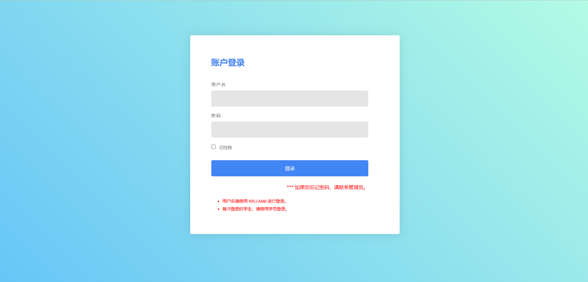

---
## 3. เปลี่ยนภาษา หน้า Dashboard ของแต่ละ Role
## **Role: Teacher และ Headproject**
Teacher และ Headproject สามารถเข้าสู่ระบบผ่าน **Dashboard** โดยใช้ **USERNAME และ PASSWORD** เช่น:
> **Email:** [pusadee@kku.ac.th](mailto:pusadee@kku.ac.th)  
> **Password:** 123456789

### **การใช้งานการเปลี่ยนภาษาในหน้า Dashboard **
ใช้ปุ่ม Dropdown เพื่อเลือกภาษาที่ต้องการ ดังรูป

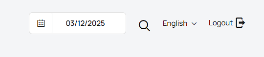  
### **เปลี่ยนภาษาใน Dashboard และเมนูต่างๆ**
- **Dashboard** 🏳️ อังกฤษ | 🇹🇭 ไทย | 🇨🇳 จีน
- **User Profile** 🏳️ อังกฤษ | 🇹🇭 ไทย | 🇨🇳 จีน
- **Manage Fund** 🏳️ อังกฤษ | 🇹🇭 ไทย | 🇨🇳 จีน
- **Research Project** 🏳️ อังกฤษ | 🇹🇭 ไทย | 🇨🇳 จีน
- **Research Group** 🏳️ อังกฤษ | 🇹🇭 ไทย | 🇨🇳 จีน
- **Manage Publications** 🏳️ อังกฤษ | 🇹🇭 ไทย | 🇨🇳 จีน

### **ตัวอย่างการใช้งานการแปลภาษา**
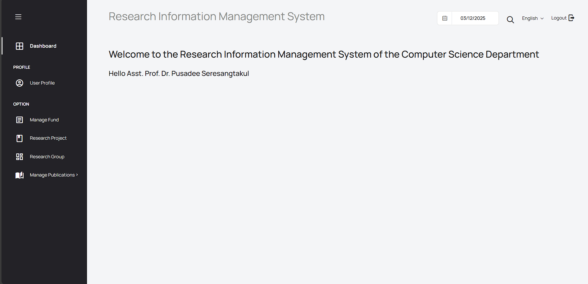  
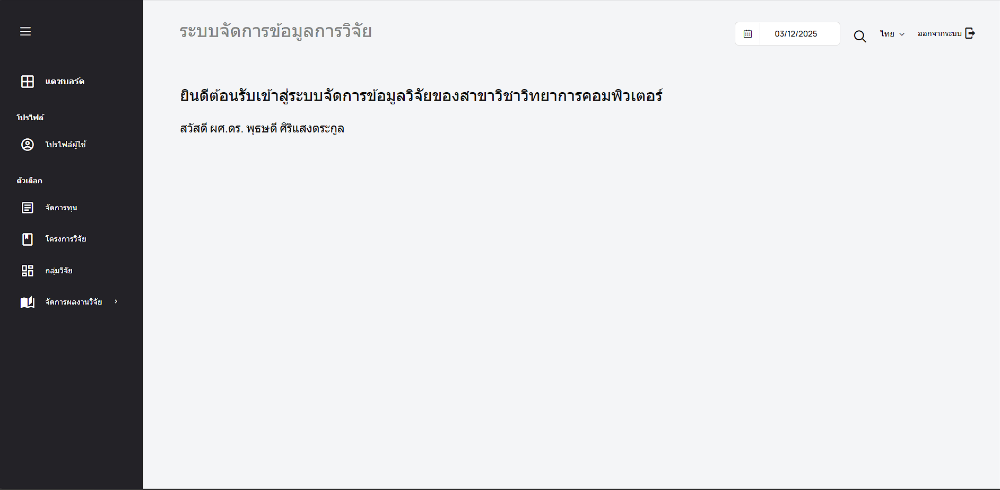  
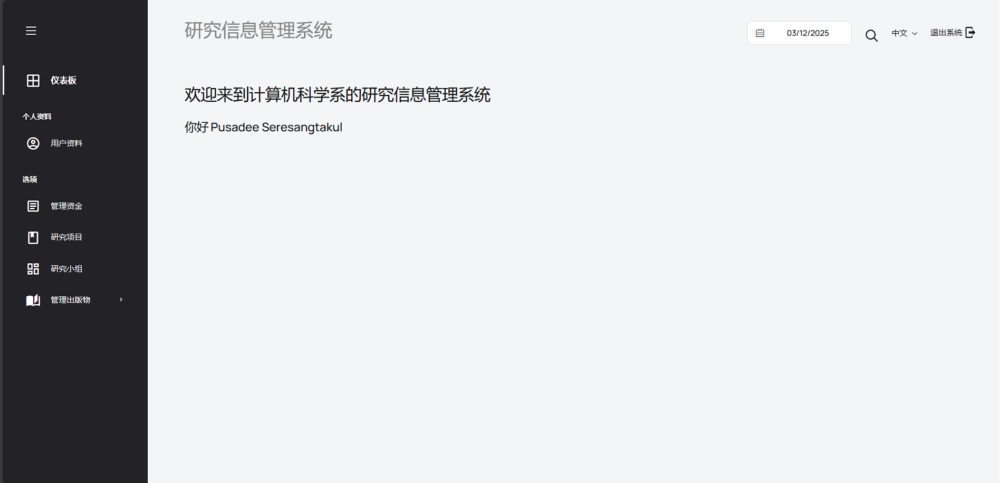

---

## **Role: Staff**
Staff สามารถเข้าสู่ระบบผ่าน **Dashboard** โดยใช้ **USERNAME และ PASSWORD** เช่น:
> **Email:** [staff@gmail.com](mailto:staff@gmail.com)  
> **Password:** 123456789

### **การใช้งานการเปลี่ยนภาษาในหน้า Dashboard **
ใช้ปุ่ม Dropdown เพื่อเลือกภาษาที่ต้องการ ดังรูป

  

### **เปลี่ยนภาษาใน Dashboard และเมนูต่างๆ**
- **Dashboard** 🏳️ อังกฤษ | 🇹🇭 ไทย | 🇨🇳 จีน
- **User Profile** 🏳️ อังกฤษ | 🇹🇭 ไทย | 🇨🇳 จีน
- **Manage Funds** 🏳️ อังกฤษ | 🇹🇭 ไทย | 🇨🇳 จีน
- **Research Project** 🏳️ อังกฤษ | 🇹🇭 ไทย | 🇨🇳 จีน
- **Research Group** 🏳️ อังกฤษ | 🇹🇭 ไทย | 🇨🇳 จีน
- **Manage Publications** 🏳️ อังกฤษ | 🇹🇭 ไทย | 🇨🇳 จีน
- **Departments** 🏳️ อังกฤษ | 🇹🇭 ไทย | 🇨🇳 จีน
- **Manage Programs** 🏳️ อังกฤษ | 🇹🇭 ไทย | 🇨🇳 จีน

### **ตัวอย่างการใช้งานการแปลภาษา**
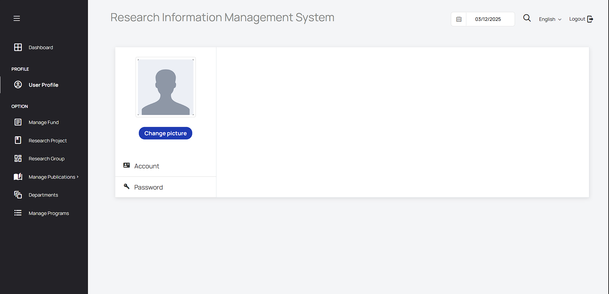  
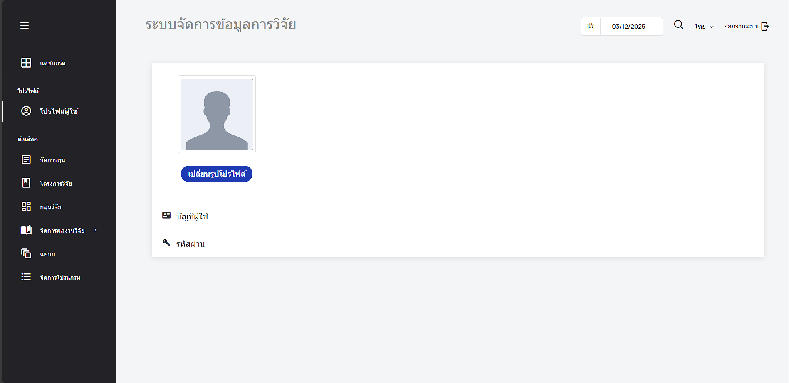  
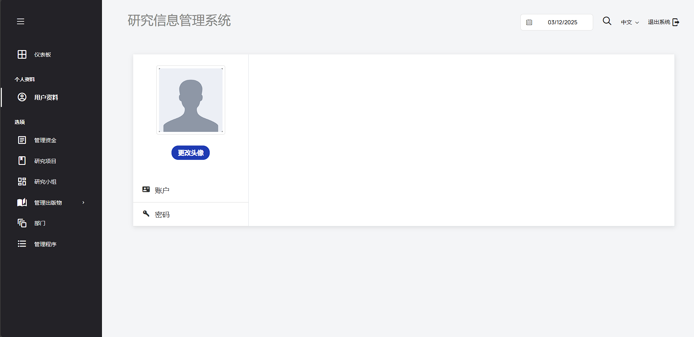

---

## **Role: Student**
Student สามารถเข้าสู่ระบบผ่าน **Dashboard** โดยใช้ **USERNAME และ PASSWORD** เช่น:
> **Email:** 615020084-7  
> **Password:** 615020084-7

### **การใช้งานการเปลี่ยนภาษาในหน้า Dashboard **
ใช้ปุ่ม Dropdown เพื่อเลือกภาษาที่ต้องการ ดังรูป

  

### **เปลี่ยนภาษาใน Dashboard และเมนูต่างๆ**
- **Dashboard** 🏳️ อังกฤษ | 🇹🇭 ไทย | 🇨🇳 จีน
- **User Profile** 🏳️ อังกฤษ | 🇹🇭 ไทย | 🇨🇳 จีน

### **ตัวอย่างการใช้งานการแปลภาษา**
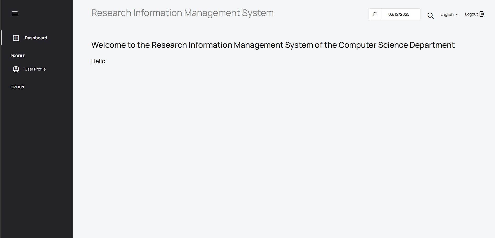  
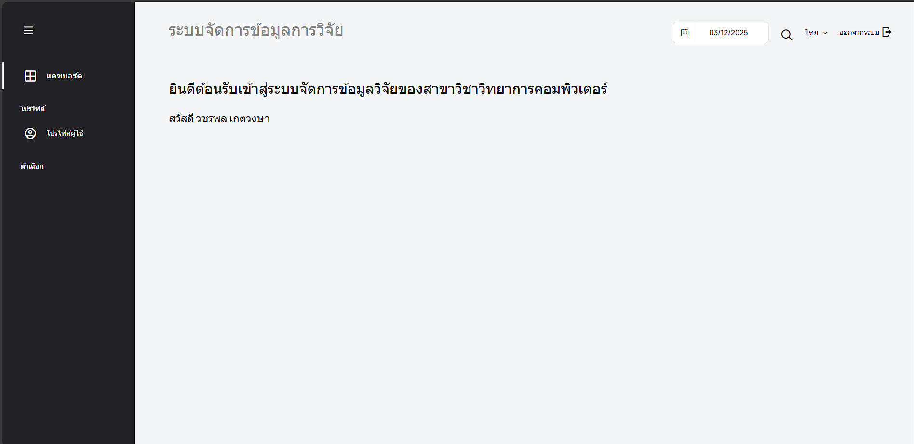  
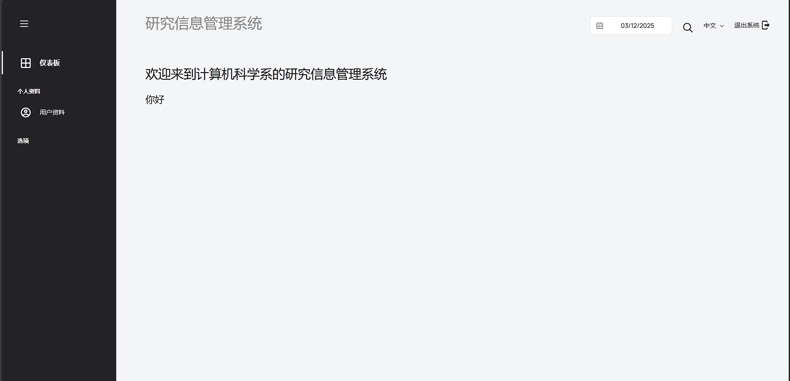

---

## **Role: Admin**
Admin สามารถเข้าสู่ระบบผ่าน **Dashboard** โดยใช้ **USERNAME และ PASSWORD** เช่น:
> **Email:** [admin@gmail.com](mailto:admin@gmail.com)  
> **Password:** 12345678

### **การใช้งานการเปลี่ยนภาษาในหน้า Dashboard **
ใช้ปุ่ม Dropdown เพื่อเลือกภาษาที่ต้องการ ดังรูป

  

### **เปลี่ยนภาษาใน Dashboard และเมนูต่างๆ**
- **Dashboard** 🏳️ อังกฤษ | 🇹🇭 ไทย | 🇨🇳 จีน
- **User Profile** 🏳️ อังกฤษ | 🇹🇭 ไทย | 🇨🇳 จีน
- **Manage Fund** 🏳️ อังกฤษ | 🇹🇭 ไทย | 🇨🇳 จีน
- **Research Project** 🏳️ อังกฤษ | 🇹🇭 ไทย | 🇨🇳 จีน
- **Research Group** 🏳️ อังกฤษ | 🇹🇭 ไทย | 🇨🇳 จีน
- **Manage Publications** 🏳️ อังกฤษ | 🇹🇭 ไทย | 🇨🇳 จีน
- **Users** 🏳️ อังกฤษ | 🇹🇭 ไทย | 🇨🇳 จีน
- **Roles** 🏳️ อังกฤษ | 🇹🇭 ไทย | 🇨🇳 จีน
- **Permission** 🏳️ อังกฤษ | 🇹🇭 ไทย | 🇨🇳 จีน
- **Departments** 🏳️ อังกฤษ | 🇹🇭 ไทย | 🇨🇳 จีน
- **Manage Programs** 🏳️ อังกฤษ | 🇹🇭 ไทย | 🇨🇳 จีน
- **Manage Expertise** 🏳️ อังกฤษ | 🇹🇭 ไทย | 🇨🇳 จีน

### **ตัวอย่างการใช้งานการแปลภาษา**
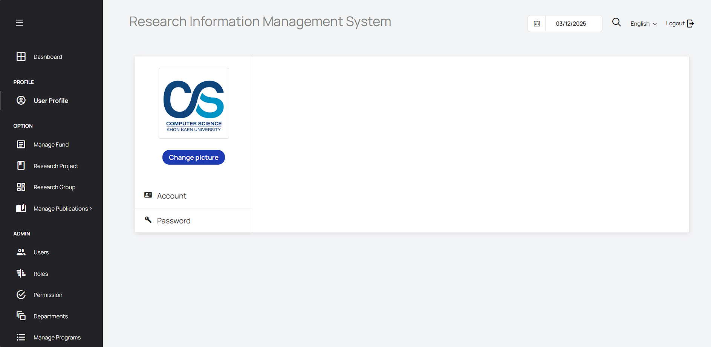  
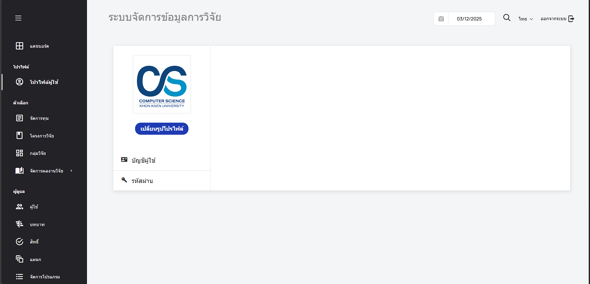  
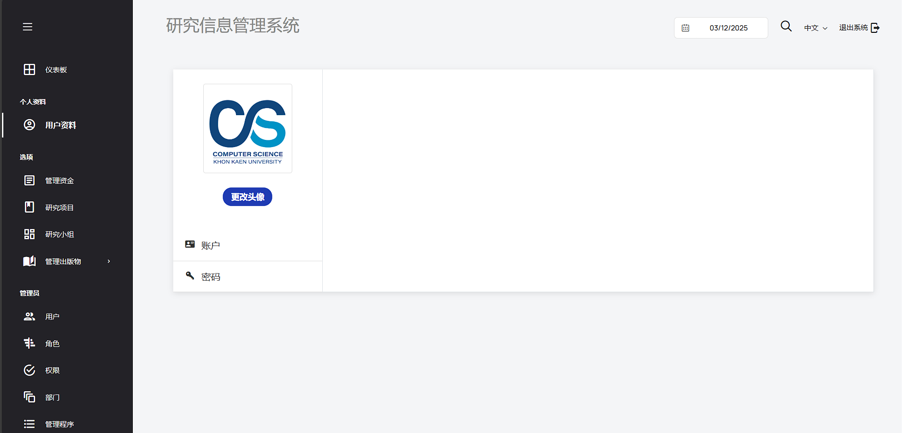
