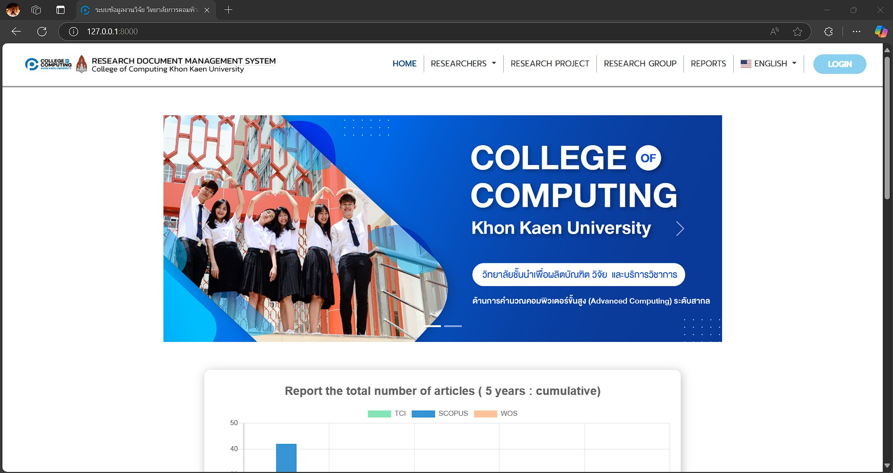
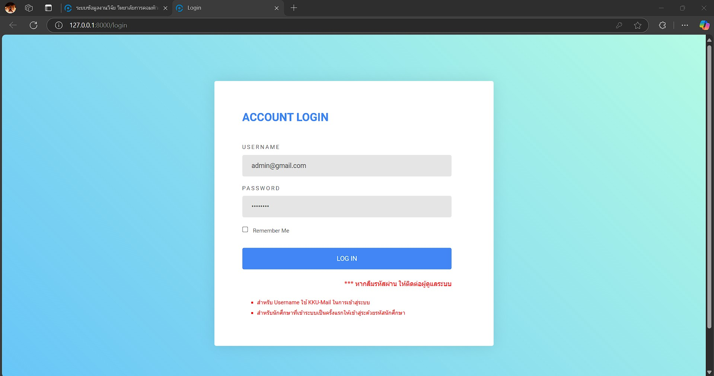
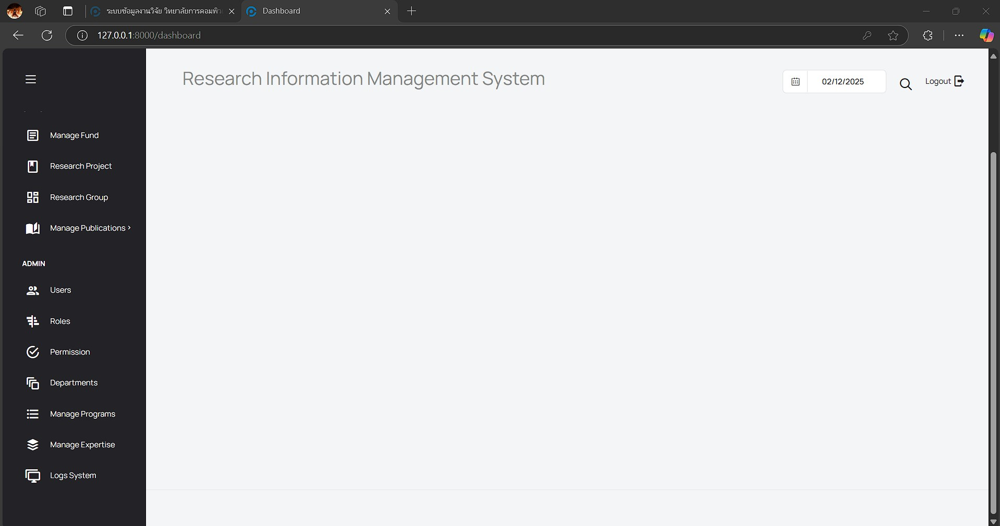
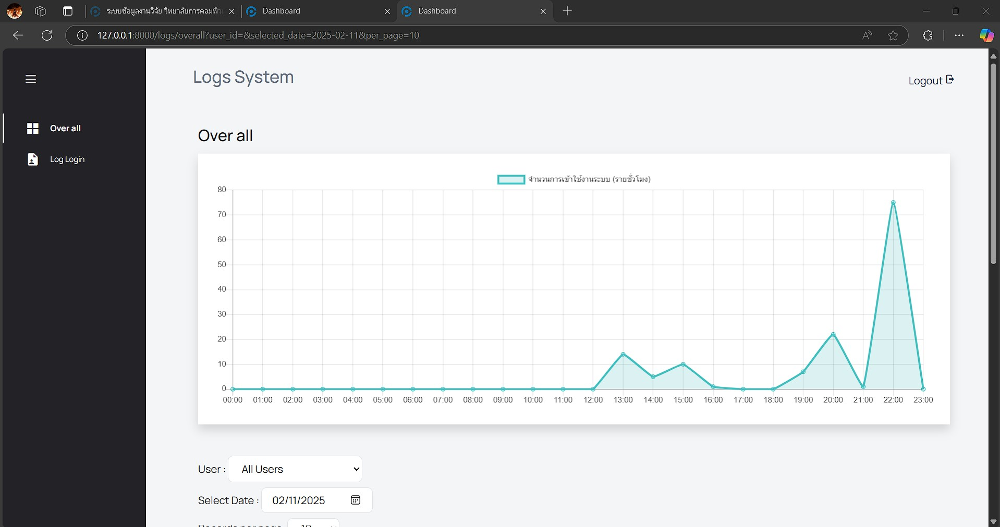
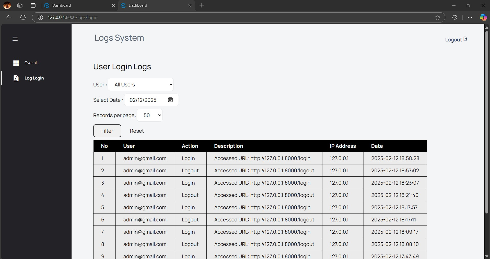
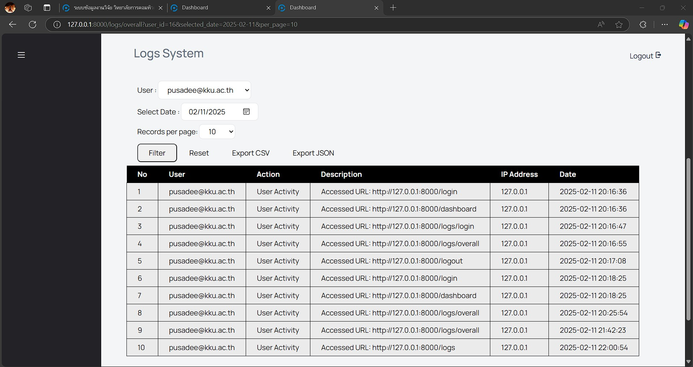

# คู่มือการใช้งานระบบ (User Manual)

## 1. การเข้าสู่ระบบ (Login)

ลิ้งค์งานของโปรเจคกลุ่ม : [https://csgroup568.cpkkuhost.com/]([https://example.com](https://csgroup568.cpkkuhost.com/))

1. คลิกที่เมนู **"LOGIN"**  

2. กรอกข้อมูลสำหรับเข้าสู่ระบบ:  
   - **Username:** `admin@gmail.com`  
   - **Password:** `12345678`  

3. กด **"LOGIN"** เพื่อเข้าถึงระบบ  

---

## 2. การใช้งาน Logs System  
1. คลิกที่เมนู **"Logs System"** เพื่อไปยังหน้าที่แสดงข้อมูลบันทึกการทำงาน  
   - ในหน้า **Logs System** จะมีข้อมูลเกี่ยวกับกิจกรรมต่างๆ ที่เกิดขึ้นภายในระบบ  
     
   
     

2. ใช้ **ฟังก์ชัน Filter** เพื่อค้นหาข้อมูลที่ต้องการ โดยสามารถระบุเงื่อนไขการค้นหา เช่น  
   - **วันที่และเวลา (Date & Time)**  
   - **ผู้ใช้ที่เกี่ยวข้อง (User)**  
   - **Sort ข้อมูล** โดยคลิกที่หัวคอลัมน์ที่ต้องการเรียงลำดับ  
   

3. หากต้องการบันทึกข้อมูล **Logs** สามารถใช้ **ฟังก์ชัน Export** เพื่อดาวน์โหลดข้อมูลที่ถูกกรองไว้ในรูปแบบไฟล์ที่ต้องการ (**CSV หรือ Excel**)  
